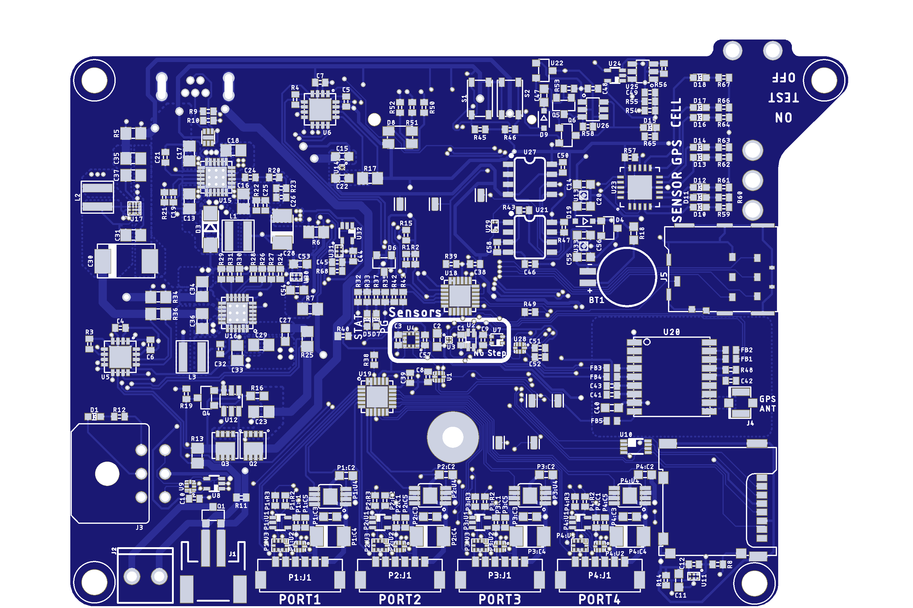
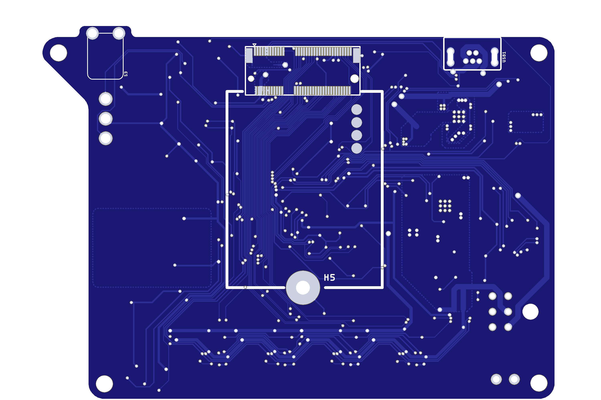
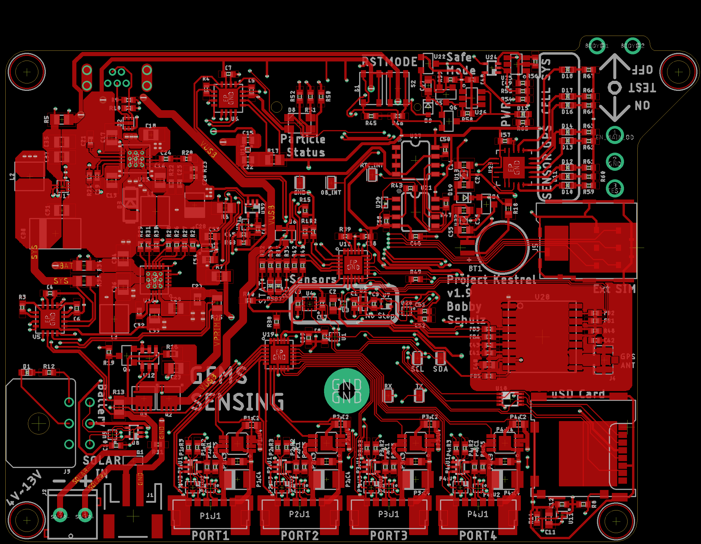
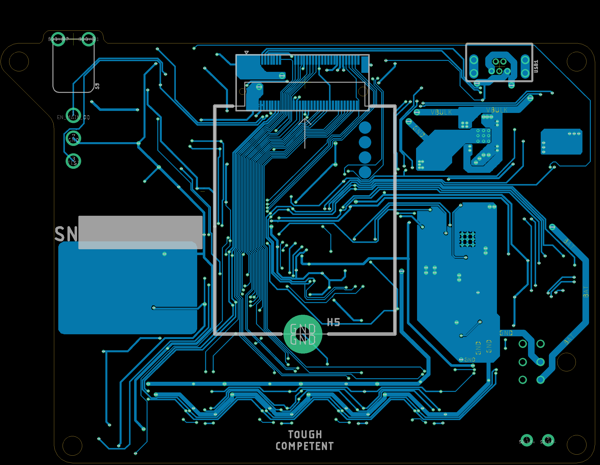

<!--  -->

# Project-Kestrel
Core board for a Flight data logger, featuring interfaces to Talon boards ([SDI-12 Talon](https://github.com/GEMS-sensing/Talon-SDI12), [I2C Talon](https://github.com/GEMS-sensing/Talon-I2C), [Auxiliary Talon](https://github.com/GEMS-sensing/Talon-Auxiliary)) and external battery board ([Gonk](https://github.com/GEMS-sensing/Project-Gonk)). This is the core component of [Flight data logger](https://github.com/GEMS-sensing/DFM_-_Flight?tab=readme-ov-file).

# Repo Roadmap
#### [Documents](Documentation/) 

General document and image storage for repo and README

#### [Hardware](Hardware/)

Current board files (Eagle), Bill of Materials (BoM), and other design documents

#### [Production](Production/)

Contains the various Gerber and pick and place files required to have the Printed Circuit Boards (PCBs) manufactured or populated 

#### [Software](Software/)

The software associated with the piece of hardware, this is usually diagnostic software used for verifying or investigating the hardware

<!-- #### [Mechanical](Mechanical/)

Mechanical design files and assembly documents -->

<!-- #### [Testing](Testing/)

Scripts and results from the testing process and development process. Contains more detailed information about documented issues among other testing. 
 -->

## Overview
* **Type:** Logger
* **Interfaces:** Talon, Gonk
* **Release Version:** v1.9 - 2023/06/23

<!--  -->

## Features
### On-Board
* Modular interfaces for Talon daughterboards (x4)
	* Isolated I2C interface
	* Individual power control and monitoring
	* Firmware selectable GPIO/UART interface
	* Polarized connector
* Battery board interface 
	* I2C interface for battery power reporting
	* Polarized connector
* Multi-charger input
	* Solar panel (6V) input
	* High power (>2A) input for fast charge in no solar situations
* [Particle BSoM](https://docs.particle.io/b-series/) M.2 interface
	* Interface for the highly flexible Particle BSoM module
* Micro USB interface 
	* Programming and charging
* Power switch
	* Complete disconnect 
	* Tri position to allow for 'ON'-'TESTING'-'OFF' modes
* LED status indicators 
* Non-Contact safe mode circuit 
	* Safe mode circuit controlled by Hall effect sensor to allow for triggering with magnet from outside logger box
* Multi-rail power system
	* Allow for independent control of subsystems, on-board and off-board
* On-board GPS Module with battery backup for improved hot start
* SD Card interface
* On-board sensing for self diagnostics
	* Voltage/current sensing (8 positions)
	* Temperature
	* Humidity
	* Accelerometer, 3 axis
	* Magnatometer, 3 axis
	* Ambient light, multi channel
* Interchangeable SIM card (future support)
* RTC with rechargeable battery backup
* FRAM storage for low power backhaul batching
* Long period WatchDog control to prevent critical lockups 

<!-- ### Interface
* I2C
* M12 circular connector  -->

<!-- <picture>
  <source media="(prefers-color-scheme: dark)" srcset="Documents/Pinout_LIGHT.png">
  
</picture> -->

<!-- ## Specifications
* **Voltage - Supply:** 3.3V
* **Voltage - Logic:** 3.3V
* **Input Current (Avg, 1s period): 30.95&mu;A @ 3.3V**
* **Input Current (Avg, 5s period): 107.43&mu;A @ 3.3V**
* **Input Current (Max): 0.45mA @ 3.3V**

#### Sensor
**Temperature** [^1]
* Range: -40 ~ 125°C 
* Accuracy: &plusmn; 0.2°C
* Repeatability: &plusmn; 0.04°C

**Pressure** [^2]
* Range: 300 ~ 1200 hPa  
* Accuracy: &plusmn; 1 hPa
* Repeatability: &plusmn; 0.06 hPa

**Humidity** [^1]
* Range: 0 ~ 100%
* Accuracy: &plusmn; 2%
* Repeatability: 0.08%

[^1]: [SHT31 Datasheet](https://sensirion.com/media/documents/213E6A3B/63A5A569/Datasheet_SHT3x_DIS.pdf)
[^2]: [DPS368 Datasheet](https://www.infineon.com/dgdl/Infineon-DPS368-DS-v01_00-EN.pdf?fileId=5546d46269e1c019016a0c45105d4b40) -->

<!-- ## Version History

`v0.0` - Initial primal version with screw terminal

`v0.1` - Initial 'hard mount' version, using M12 connector

`v1.0` - Removed pullup select[^3], added logic level buffer and voltage reg on input

`v1.1` - Moved via away from connector pads to prevent bridging when soldering 

`v2.0` - Fixed issue with address select jumper[^3] -->

<!-- ## Jumper Settings 

> [!IMPORTANT]
> Jumper settings valid for version `v2.0` and beyond[^3]

[^3]: See Errata

**Configuration Jumpers**
| Jumper | Purpose | Open | Closed | Default | 
| ------ | ------- | ---------- | ---------- | ----- | 
| `JP1` | I2C Address Select | Base Address&dagger; | Alt Address&Dagger; | Open |

&dagger; SHT31 = `0x44`, DPS368 = `0x76`

&Dagger; SHT31 = `0x44`, DPS368 = `0x77`
 -->

## Known Issues/Errata

#### Solder Jumper Stencil

**Version Affected:** All

**Issue:** Solar input does not support very low impedance sources (e.g. lead acid battery) - see details in issue [#20](https://github.com/GEMS-sensing/Project-Kestrel/issues/20)

**Workaround:** 

* Avoid use of low impedance batteries for input
* Include series impedance to prevent current spikes (not desirable)
* Perform board patch described in issue [#20](https://github.com/GEMS-sensing/Project-Kestrel/issues/20)
